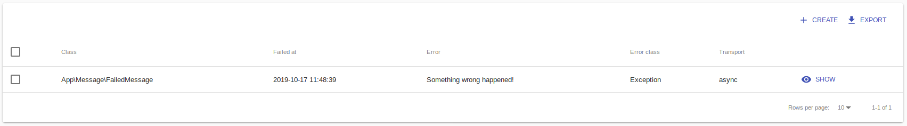

When there are something wrong happen, a failed message will be created automatically.

What you can do:

1. Check your code (model, subject) or environment variables to make sure nothing wrong
2. Retry
3. Remove: delete completely. Any running task can be affected

---

You probably will ask why we named it `Failed Message`. It's because this MBT Bundle tool devide jobs into messages. Each job like executing a task, reducing a bug, or reporting a bug can be split into multiple messages. The reason is scaling. We can add more workers to handle more messages. The problem is what happen when there is an error while processing a message? We drop that message, and create a failed message instead. When we retry a failed message, a new message will create, and this failed message will be temporary removed.
