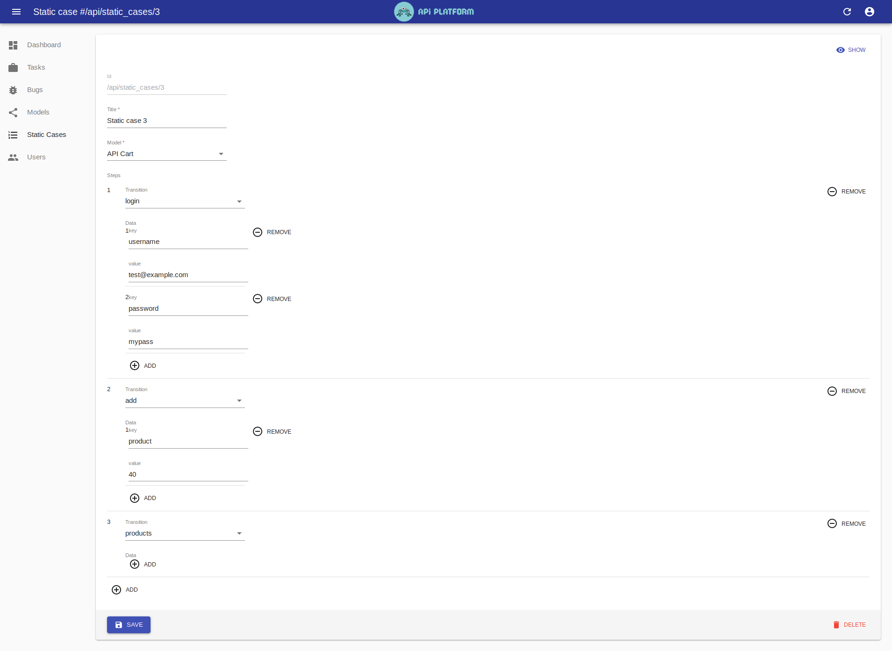

## Definition

Predefined case just like traditional automation test case. It contains pre-defined steps so that we can test it right away.

Here is an example of a predefined case:

To create a predefined case, we need to provide:

1. Title: What does this predefined case about
2. Model: which model this predefined case belong to
3. Steps:
    1. Transition: Action we want to do
    2. Data: data provided for that action
        1. Key: need to be different from other keys
        2. Value: value for that key

---

## Compare

So why predefined case? Are test cases supposed to be generated automatically from `model`?

Good question! Predefined case is useful when we need to test specific case quickly without waiting for new test cases to be generated from `model`. Nothing will guarantee that the exact test case will be generated everytime a task is in progress. When we are in a deadline of testing system under test, this feature can be useful. But it come with a cost. We need to maintain predefined case when the model (business logic) changed. The more predefined cases we have, the more effort we need to put.

| Types             | Model               | Predefined Case |
| ----------------- | :-----------------: | :-------------: |
| Dynamic test case | Yes                 | No              |
| Maintain          | Less effort         | More effort     |
| Find more bugs    | Yes                 | No              |
| Quickly test      | Depend on generator | Yes             |
