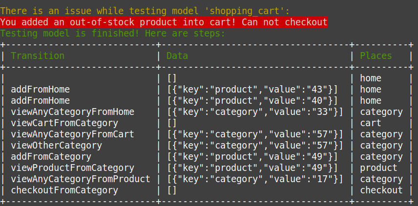

## Generate code

### Subject

```bash
php bin/console make:subject model_name ClassName
```

### Generator

```bash
php bin/console make:generator model_name ClassName
```

### Reducer

```bash
php bin/console make:reducer model_name ClassName
```

## Test model

```bash
php bin/console mbt:model:test [MODEL_NAME] --generator random --generator-options '{"maxSteps": 20}'
```

Here is result:

